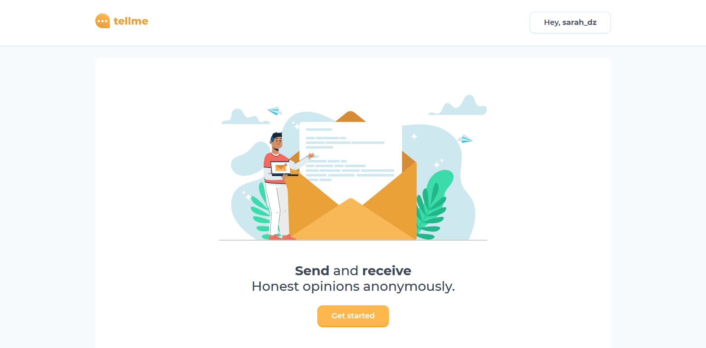
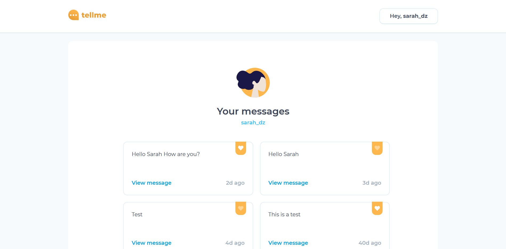

# Tellme

 
**Tellme** is a MERN app that provides a service for sending and receiving opinions anonymously.
n
### Screenshots

 

**Live preview:** [Tellme](https://tellme-mern.herokuapp.com/)

### How to use

1. Clone/Download the repo.
2. Install dependencies:
   <code>yarn install</code> or <code>npm install</code>
3. Edit your /config/default.json file to include the correct MongoDB URI
4. Run <code>yarn start</code> or <code>npm start</code>.
5. You are ready!
